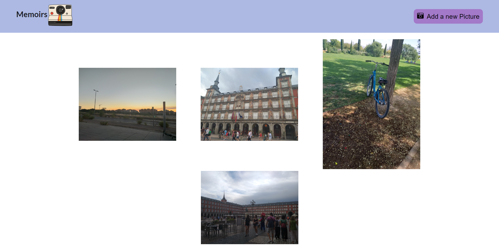
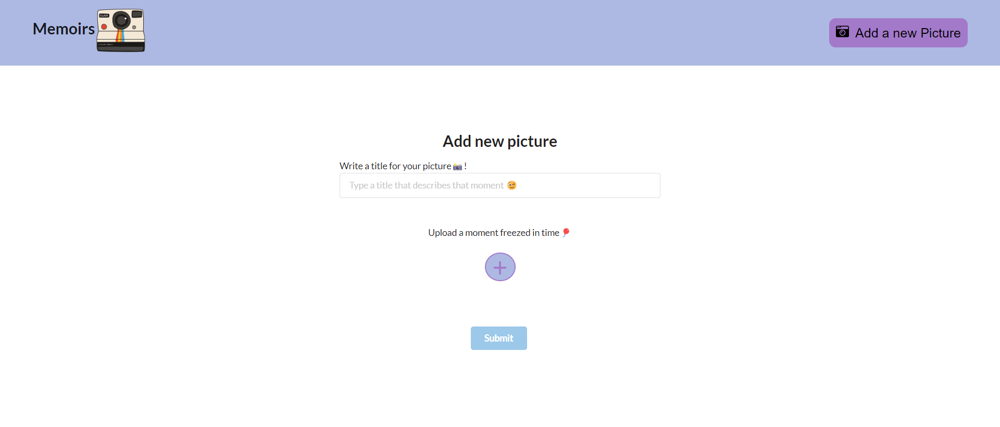

# MEMOIRS: Gallery Photo App

<!--  -->

* `Home section where images are displayed`



* `Form section to upload a Picture`



This project was bootstrapped with [Create React App](https://github.com/facebook/create-react-app).

This is a web app where the user can store their favorite images, adding a title, and of course the data can be updated or deleted.

## `Stack used:`

### React
### FireBase
### canva
### Github
### Cypress

## `Technologies:`

### HTML 5
### CSS 3
### JavaScript

## `Libraries:`

### semantic-ui-react
### react-icons

## Development
_You can easily set up this project and try it yourself!_

* `First:` clone the project
* `Second:` then run on your terminal, after opening the project

```bash
> npm install *if this one does not work then:*
> npm install --force
> npm start
```

And to peek the testing files, made with Cypress:


```bash
> npx cypress open
```

**Project will start in [http://localhost:3000](http://localhost:3000)!** 🎉

If you encounter problems while uploading an image, try removing your server cookies 🍪
